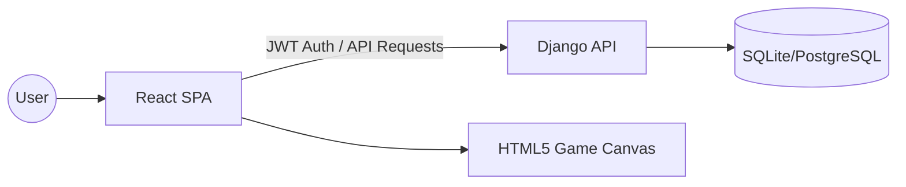

# GameHub: Technical Documentation

Welcome to the technical deep-dive of **GameHub: Cosmic Edition**. This document provides detailed information about the system architecture, API endpoints, and development workflows.

---

## 🏗️ System Architecture

GameHub follows a modern **Decoupled Architecture**:

- **Frontend**: A high-performance Single Page Application (SPA) built with **React 19** and **Vite**. It handles all UI rendering, game state, and user interactions.
- **Backend**: A **Django REST Framework (DRF)** API server that manages user accounts, global leaderboards, game analytics, and security.
- **Communication**: The frontend communicates with the backend via **RESTful APIs** using **Axios** with JWT (JSON Web Token) authentication.

### Component Diagram


---

## 🔐 Authentication Protocol

We use **JWT (SimpleJWT)** for secure, stateless authentication.

1. **Login**: User sends credentials to `/api/token/`.
2. **Access Token**: Server returns an access and refresh token.
3. **Authorization**: Frontend includes the access token in the `Authorization: Bearer <token>` header for protected routes.
4. **Refresh**: When the access token expires, the frontend uses the refresh token to get a new one without logging the user out.

---

## 📡 API Reference

### Accounts & Auth
| Endpoint | Method | Description |
| :--- | :--- | :--- |
| `/api/register/` | `POST` | Create a new cosmic citizen account. |
| `/api/token/` | `POST` | Obtain access & refresh tokens. |
| `/api/token/refresh/` | `POST` | Refresh expired access tokens. |
| `/api/profile/` | `GET/PUT` | Manage user profile and stats. |

### Leaderboard & Analytics
| Endpoint | Method | Description |
| :--- | :--- | :--- |
| `/api/leaderboard/` | `GET` | Fetch global rankings across all games. |
| `/api/game-stats/` | `POST` | Record a new high score or game session. |

---

## 🎮 Game Integration Engine

Games in GameHub are encapsulated as static HTML5 components.

### Directory Mapping
All game assets are served from the Vite public directory:
`frontend/public/games/<game-id>/index.html`

### Data Schema (`games.js`)
Frontend registry for games:
```javascript
{
    id: "snake-cosmic",
    title: "Snake: Void Runner",
    description: "Navigate the void and collect energy orbs.",
    image: "/assets/games/snake.png",
    file: "/games/snake/index.html",
    category: "arcade",
    difficulty: "Medium"
}
```

---

## 🛠️ Development Workflow

### Frontend Styling
We use **Tailwind CSS 4** for styling. The "Cosmic Neon" design system is defined in `tailwind.config.js` and `index.css` using CSS variables for high customizability.

### State Management
**Zustand** is used for global state (Auth, User Stats, UI Overlays). It provides a lightweight, hook-based alternative to Redux.

---

## 🚢 Deployment Strategy

- **Frontend**: Optimized for edge deployment (Vercel, Netlify).
- **Backend**: Containerized (Docker) for consistent environments on Railway or Render.
- **Database**: Uses SQLite for local development and PostgreSQL for production.

---

<p align="center">
  <i>Documentation version 1.0.0 | Updated by Chirag1724</i>
</p>
