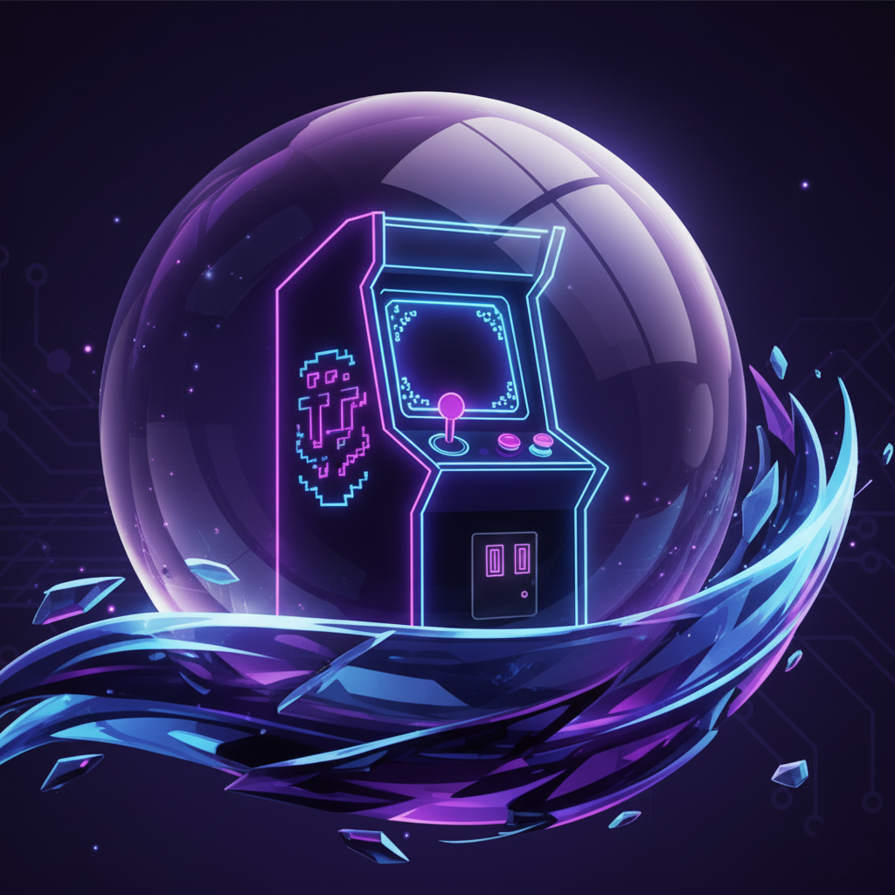
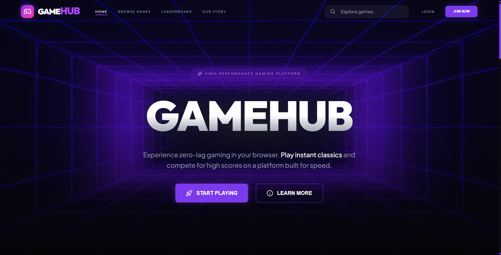

<a name="-top"></a>

<div align="center">
  
  <h1>GameHub: Cosmic Edition</h1>
  
  <p align="center">
    <b>Experience the next generation of browser gaming. High-performance, low-latency, and stunning cosmic aesthetics.</b>
  </p>

  <p align="center">
    
    
    
    
  </p>

  <p align="center">
    <a href="https://gamehub-cosmic.vercel.app">
      
    </a>
  </p>

  <p align="center">
    <a href="#-about-gamehub">About</a> •
    <a href="DOCS.md">Technical Docs</a> •
    <a href="#-quick-start">Quick Start</a> •
    <a href="#🌟-contributing">Contribute</a> •
    <a href="https://github.com/kaifansariw/GameHub/issues">Request Feature</a>
  </p>
</div>

---

<p align="center">
  
  <br>
  <i>The Cosmic Neon Library Interface</i>
</p>

---

### 🛡️ Protocol Guidelines (ECWoC26)
> [!IMPORTANT]
> *   **Star the Repo**: Your contribution only counts if you've starred the repository. ⭐
> *   **Documentation**: Proper docs are required for every new feature. Share them via mail.
> *   **Meaningful Issues**: Only high-impact issues will be considered.
> *   **Leaderboard Priority**: Priority is given to contributors with lower ranks.

---

## 🗺️ Table of Contents
- [💡 About GameHub](#-about-gamehub)
- [✨ Features](#-features)
- [🛠️ Tech Stack](#-tech-stack)
- [📁 Project Structure](#-project-structure)
- [🚀 Quick Start](#-quick-start)
- [🎮 Adding New Games](#-adding-new-games)
- [🌟 Contributing](#-contributing)
- [✨ Contributors](#-contributors)
- [📄 License](#-license)

---

## 💡 About GameHub
**GameHub** is an elite, open-source collection of classic and modern browser games. Re-imagined with a **Cosmic Blue Neon** aesthetic, it combines the nostalgia of retro gaming with the performance of industry-standard web tech.

Originally a Vanilla JS project, GameHub has been upgraded to a **React-Django Hybrid** architecture to support massive scalability, premium animations, and a global leaderboard system.

---

## ✨ Features

<div align="left">

| Feature | Description |
| :--- | :--- |
| 🚀 **Modern Engine** | Built with **React 19** for sub-millisecond responsiveness. |
| 🎨 **Cosmic UI** | High-end Glassmorphism and Neon design system. |
| 🕹️ **50+ Titles** | Instant play library including Retro classics. |
| 🏆 **Leaderboards** | Global competition powered by a Django REST backend. |
| 📱 **Responsive** | Perfect parity between Desktop, Tablet, and Mobile. |
| 🛠️ **Modular code** | Clean architecture designed for easy open-source entry. |

</div>

---

## 🛠️ Tech Stack

| Tier | Technology | Icon |
| :--- | :--- | :---: |
| **Frontend** | React 19, Framer Motion |  |
| **Styling** | Tailwind CSS 4, Lucide Icons |  |
| **Backend** | Django REST Framework |  |
| **State** | Zustand Global Store | 🐻 |
| **Build Tool** | Vite (Ultra-fast HMR) |  |

---

## 📁 Project Structure
```text
GameHub/
├── frontend/                # React Application (Vite)
│   ├── src/
│   │   ├── components/      # UI Elements & Layouts
│   │   ├── pages/           # High-Fidelity Views
│   │   ├── data/            # Game Registries (games.js)
│   │   └── store/           # Zustand Logic
│   └── public/              # Assets & Static Games
│
├── backend/                 # Django REST API
│   ├── accounts/            # Auth & Leaderboards
│   └── gamehub_project/     # Core Settings
│
├── DOCS.md                  # Technical Deep-Dive
└── README.md                # Project Overview
```

---

## 🚀 Quick Start

### 1️⃣ Clone the Repo
```bash
git clone https://github.com/kaifansariw/GameHub.git
```

### 2️⃣ Initialize Frontend
```bash
cd frontend
npm install
npm run dev
```

### 3️⃣ Initialize Backend
```bash
cd backend
python -m venv venv
# Win: .\venv\Scripts\activate | Mac/Linux: source venv/bin/activate
pip install -r requirements.txt
python manage.py runserver
```

---

## 🎮 Adding New Games
Registering a new title in the Cosmic Library:

1. **Upload Assets**: Folder at `frontend/public/games/<game-id>/`.
2. **Register Metadata**: Edit `frontend/src/data/games.js`:
```javascript
{
    id: "quantum-racer",
    title: "Quantum Racer",
    description: "Multi-dimensional racing experience.",
    image: "/assets/thumbs/quantum.png",
    file: "/games/quantum/index.html",
    category: "racing"
}
```

---

## 🌟 Contributing
We ❤️ our contributors! Whether it's a bug fix or UI polish:

1. **Fork** → **Branch** (`git checkout -b feat/CoolFeature`) → **Commit** → **Push** → **PR**.

---

## ✨ Contributors
The heroes behind the Cosmic Engine:

<a href="https://github.com/kaifansariw/GameHub/graphs/contributors">
  
</a>

---

## 📄 License
This project is licensed under the **MIT License**.

---

<div align="center">
  <p>Maintained by <b>Kaif Ansari</b> & the Open Source Community</p>
</div>

---
<div align="center">
<a href="#-top">Back to Top ↑</a>
</div>